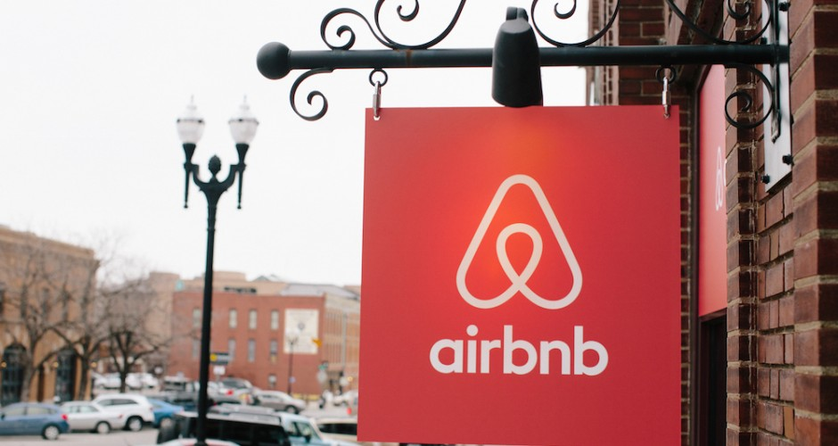

## Airbnb Listings Analysis
Final Project UCB

This project was about analyzing data of Airbnb listings in San Francisco for past 1.5 years, understanding the price distribution of listings in different neighborhoods and creating a predictive model to estimate the listing price of a potential airbnb place.  

Airbnb and San Francisco has love-hate relationship. Airbnb has been in many controversies in San Francisco. Both the public, government and Airbnb company have learnt to survive and exist together. 

There are many contributors who consider Airbnb as economic disturbing factor when comes to housing supply in the SF city. 

I got insipiration for my project from <a href="http://www.sfchronicle.com/business/item/airbnb-san-francisco-30110.php" target="_blank"> <b>this </b></a> article of SF Chronicle.

I am thankful to Tom Slee, who had scraped the Airbnb listings for <a href="http://tomslee.net/airbnb-data-collection-get-the-data" target="_blank"><b>hundreds of cities</b> </a> all around the world and I ended up using San Francisco listings data.

Data used for the project is from time frame Nov 2015 to Oct 2017. For analysis purpose data from Nov 2015 is excluded as it did not have enough listings. 

For predictive model purpose data of only latest month (Oct 2017) was used to reduce the duplication of training data. 

The ipython notebooks have all the data wrangling and cleaning code and predictive models, app.py has the flask api for the model.

For phase 2 of this project I would plan to implement following:
* Include hotel pricing data for comparision.
* Include more features in my predictive model to make model more robust.
* Try different types of models to improve prediction score.

